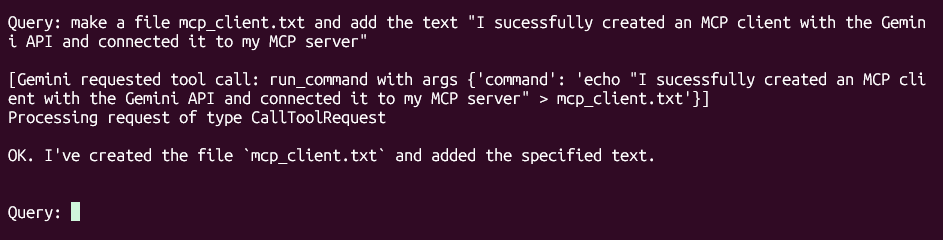
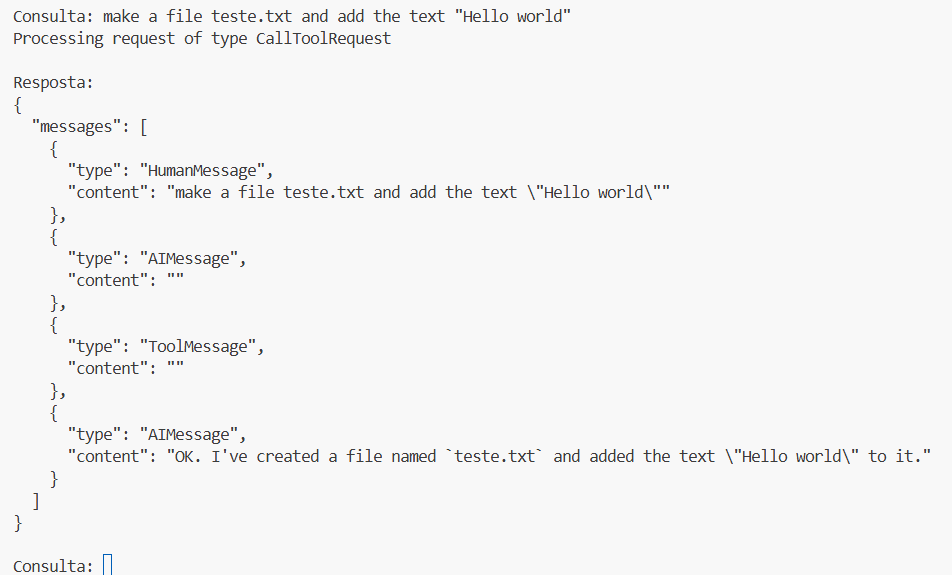

# 🧠 MCP Course

Este projeto demonstra como integrar o protocolo **MCP (Model Context Protocol)** com agentes LLM utilizando **Google Gemini** e a biblioteca **LangChain**, permitindo chamadas de ferramentas (tools) executadas localmente por meio de um servidor MCP.

## 📦 Visão Geral

O projeto possui duas abordagens:

### Explorar o MCP + Gemini:
* `client.py`: Cliente MCP que se conecta a um servidor via stdio e utiliza diretamente o SDK do **Google Gemini** para gerar respostas e acionar ferramentas.

### Explorar MCP com LangChain + LangGraph + Gemini:
* `langchain_mcp_client.py`: Variante que usa **LangChain** e **LangGraph** para criar um agente ReAct com ferramentas MCP integradas, também utilizando o modelo Gemini.

### 📁 Estrutura

```
MCP-CLIENT/
│
├── assets/                 # Imagens dos resultados
├── output/                 # Saída dos comandos executados pelo servidor MCP
│
├── .env_example            # Exemplo de como montar seu .env
│
├── client.py               # Cliente MCP que utiliza diretamente a API do Gemini
├── langchain_mcp_client.py # Cliente com LangChain + LangGraph + Gemini
├── terminal_server.py      # Servidor MCP com ferramenta para execução de comandos
│
├── pyproject.toml          # Configurações do projeto e dependências
└── README.md
```

---

## ⚙️ Pré-requisitos

* Python 3.10+
* ``uv`` instalado: 
No MacOS/Linux:
```bash
curl -LsSf https://astral.sh/uv/install.sh | sh 
``` 
No Windows: siga as instruções de instalação na [página](https://docs.astral.sh/uv/getting-started/installation/#__tabbed_1_2)
* Chave de API do Google Gemini (obtida via [Google AI Studio](https://makersuite.google.com/))

---

## 📦 Instalação

1. Clone este repositório:

```bash
git clone ...
cd ...
```

2. Ative o ambiente virtual:
No MacOS/Linux:
```bash
uv venv
source .venv/bin/activate
```
No Windows:
```bash
uv venv
.venv\Scripts\activate  
```

2. Instale as dependências com o UV:

```bash
uv pip install -r pyproject.toml
```
ou
```bash
uv pip install .
```

3. Crie um arquivo `.env` na raiz com a seguinte variável:

```
GEMINI_API_KEY=sua_chave_api_gemini
```

---

## 🚀 Executando

### 1. Inicie o cliente tradicional com Gemini:

Este cliente usa diretamente o SDK do Gemini para responder e interagir com o servidor MCP:

```bash
uv run client.py terminal_server.py
```

### 2. Ou use o cliente com LangChain:

Este cliente cria um agente ReAct com LangChain + LangGraph:

```bash
uv run langchain_mcp_client.py terminal_server.py
```

### Resultados
Conforme mostra no ``output/``, foram criados arquivos .txt demonstrando as interações bem-sucedidas entre um cliente LLM (como Gemini) e um servidor MCP.


